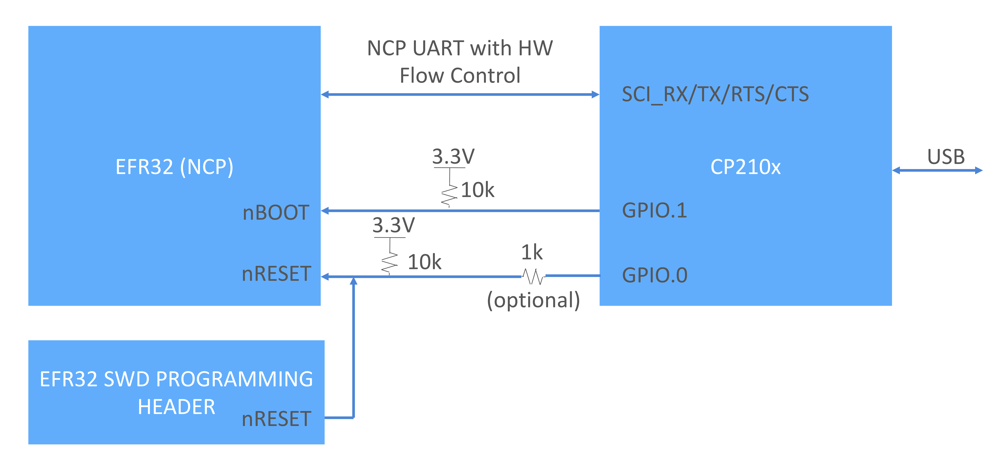

# CP210x Gecko Bootloader Activation

This repo provides information on using the GPIO of a CP210x usb-to-serial converter to activate the gecko bootloader on a Silicon Labs EFR32. Bootloader activation is useful as a way to always be able to upgrade the firmware on a device, regardless of the state of the application firmware. This avoids the possibility of "bricking" the device. This is normally done via direct GPIO access from a host processor to the device, but when the device is being accessed serially behind a CP210x usb-to-serial converter, the direct GPIO access to the host is usually not present. But the CP210x have GPIOs that are accessible via USB, and these can be used to drive the pins on the target device to activate the bootloader.

GPIO activation of the gecko bootloader is straightforward:
1. Assert reset (drive nRESET low).
2. Make sure the bootloader activation pin is asserted when de-asserting nRESET. In this case, we are making the bootloader activation pin active low (nBOOT), so this means making sure nBOOT is low when nRESET transitions from low to high.
3. De-assert the bootloader activation pin. Note that this pin can be re-used for a different purpose in the application.

## HW Prerequisites
1. CP2105 or CP2102N (designed to work with other CP210x also, but only tested with these)
2. EFR32/EFM32 with xmodem gecko bootloader flashed
3. Connect one GPIO of the CP210x ports to nRESET. Note that it's difficult to connect to the target nRESET pin when using a radio board connected to the WSTK. For this reason, I recommend using the BRD8016A that comes with the [EXP4320A WGM110 Wi-Fi Expansion Kit](https://www.silabs.com/documents/public/user-guides/ug291-exp4320a-user-guide.pdf). You can install a radio board on this board and access pins via the 40 pin header (not installed by default). See below for an example pinout using BRD4158A as the target.
4. Connect another CP210x GPIO to a pin configured in the gecko bootloader as an active low bootloader activation pin (i.e. nBOOT or "btlact").
5. Connect the RX pin of the CP210x port to the TX pin of the target device.
6. Connect the TX pin of the CP210x port to the RX pin of the target device.

Here's an example schematic showing a CP210x with the recommended connections.



Note that the resistors are recommended for a robust production design but not needed to run it as a demo as the CP210x has weak internal pullups on its GPIO pins. Also note that HW flow control is not really needed for reliable xmodem transfer, since xmodem implements its own flow control protocol. However, HW flow control is always recommended when using UARTs for Silicon Labs NCP (Network Co-processor) interfaces.

Here's my pinout using a BRD4158A installed on a BRD8016A:

| EFR32xG13 Pin | Function                      | BRD8016A 40-pin Header | CP210x Pin |
| ------------- | ----------------------------- | ---------------------- | ---------- |
| PF6           | Bootloader Entry (active low) | 7                      | GPIO.1     |
| nRESET        | Active low reset              | 16                     | GPIO.0     |
| PA3           | Target RX                     | 11                     | TX         |
| PA2           | Target TX                     | 36                     | RX         |

## Installing and Running on Raspberry Pi Using Python

The Python3 implementation here is hard coded for GPIO.0 = reset and GPIO.1 = active low bootloader activation. But it's easily modifiable for different pins.

Instructions are as follows:
1. Clone the repo.

```
$ git clone https://github.com/silabs-KrisY/cp210x_bootloader_activation.git
```

2. Use pip to install the required python libraries.

```
$ pip3 install pyserial --user
$ pip3 install pyusb --user
$ pip3 install xmodem --user
```

3. Note that by default, all users don't have direct access to USB devices. We can provide all users with access to CP210x devices by adding the following line to the beginning of /etc/udev/rules.d/99-com.rules:
```
SUBSYSTEM=="usb",ATTRS{idVendor}=="10c4",MODE="0666"
```
  Once you add this, reload the rules so they take effect:
```
$ sudo udevadm control --reload-rules
$ sudo udevadm trigger
```

4. To update the device on the CP2105 ECI port (COM port /dev/ttyUSB0, USB interface \#0):
```
$ python3 cp210x_xmodem_activation.py flash -p /dev/ttyUSB0 -i 0 -f soc_empty.gbl
Restarting NCP into Bootloader mode...
Found device! PID=0xea70 (CP2105)
BL version:Gecko Bootloader v1.12.00

Successfully restarted into bootloader mode! Starting upload of NCP image...
Finished!
Rebooting NCP...
```

5. To update the device on the CP2105 SCI port (COM port /dev/ttyUSB1, USB interface \#1):
```
$ python3 cp210x_xmodem_activation.py flash -p /dev/ttyUSB1 -i 1 -f soc_empty.gbl
Restarting NCP into Bootloader mode...
Found device! PID=0xea70 (CP2105)
BL version:Gecko Bootloader v1.12.00

Successfully restarted into bootloader mode! Starting upload of NCP image...
Finished!
Rebooting NCP...
```

5. To update the device on a CP2102N port (COM port /dev/ttyUSB0):
```
$ python3 cp210x_xmodem_activation.py flash -p /dev/ttyUSB0 -f soc_empty.gbl
Restarting NCP into Bootloader mode...
Found device! PID=0xea60 (CP2102N_CP2103_CP2104)
BL version:Gecko Bootloader v1.12.00

Successfully restarted into bootloader mode! Starting upload of NCP image...
Finished!
Rebooting NCP...
```

6. To scan for CP210x ports:
```
$ python3 cp210x_xmodem_activation.py scan
/dev/ttyUSB1
   Desc: CP2105 Dual USB to UART Bridge Controller - Standard Com Port
   HWID: USB VID:PID=10C4:EA70 SER=003334E8 LOCATION=1-1.4:1.1
/dev/ttyUSB0
   Desc: CP2105 Dual USB to UART Bridge Controller - Enhanced Com Port
   HWID: USB VID:PID=10C4:EA70 SER=003334E8 LOCATION=1-1.4:1.0
```
## Installing and Running on Raspberry Pi Using gpiod

The [Silicon Labs VCP driver for the CP210x](https://www.silabs.com/documents/login/software/Linux_3.x.x_4.x.x_VCP_Driver_Source.zip) and recent versions of the [Linux community driver for CP210x](https://github.com/torvalds/linux/blob/master/drivers/usb/serial/cp210x.c) (kernel version 5.14 and later) provide direct access to the CP210x GPIO pins via [gpiod](https://git.kernel.org/pub/scm/libs/libgpiod/libgpiod.git/tree/README).

1. Make sure you are using a recent version of Raspbian. For this example, I used Raspbian 11 "Bullseye" which has a kernel version of 5.15:
```
$ cat /proc/version
Linux version 5.15.32-v7+ (dom@buildbot) (arm-linux-gnueabihf-gcc-8 (Ubuntu/Linaro 8.4.0-3ubuntu1) 8.4.0, GNU ld (GNU Binutils for Ubuntu) 2.34) #1538 SMP Thu Mar 31 19:38:48 BST 2022
```
2. Install gpiod via "sudo apt install gpiod". I recommend rebooting after install.
3. Connect your CP210x to the Raspberry Pi USB port and check for the cp210x GPIO support. The following example is for a CP2108 which has 16 gpios:
```
$ gpiodetect
gpiochip0 [pinctrl-bcm2835] (54 lines)
gpiochip1 [brcmvirt-gpio] (2 lines)
gpiochip2 [raspberrypi-exp-gpio] (8 lines)
gpiochip3 [cp210x] (16 lines)
```
4. Run the [reset_target_gpiod.sh](reset_target_gpiod.sh) example script from this repo to activate bootloader mode on the target using the CP210x GPIOs. The first argument in the script is the "gpiochip" device corresponding to the CP210x, the second argument is the CP210x number of the bootloader activation pin, the third argument is the CP210x GPIO number of the nRESET pin, and the final (optional) argument is "-btl_act" which is required for bootloader activation. For example, taking the suggested pins from this README (GPIO.0 = nRST, GPIO.1=bootloader activation), and taking the output of gpiodetect ("gpiochip3" here):
```
$ ./reset_target_gpiod.sh gpiochip3 1 0 -btl_act
```
5. Now the target should be in bootloader mode, so you can just run the [xmodem_bootload.sh](xmodem_bootload.sh) example script to upload the GBL file via xmodem transfer (115200, 8N1, no flow control):
```
$ ./xmodem_bootload.sh /dev/ttyUSB0 newapplication.gbl
```

## Installing and Running on Raspberry Pi Using libusb
An alternate implementation uses libusb 1.0 to bypass the Linux kernel driver and send the USB requests directly to the device to manipulate the GPIO. This avoids the complexities of dealing with kernel drivers and python (which could be useful in some systems). An example implementation is provided in the /libusb folder of this repo.

1. Install libusb 1.0:
   ```
   sudo apt-get install libusb-1.0
   ```

2. cd to /libusb in the repo and execute "make". Note there's also a "make debug" option that enables copious amounts of debug logging.

3. The resulting executable takes care of exercising the reset and bootloader activation pins of the target in order to initiate bootloader mode. It does not take care of physically performing the bootload. The usage is:

./exe/cp210x_gpio_activation_libusb --reset <cp210x_gpionum> --btlact <cp210x_gpionum> --interface <cp2105_interfacenum>

* --reset       This supplies the number of the CP210x GPIO connected to nRESET of the EFR32.
* --btlact      This argument supplies the number of the CP210x GPIO connected to the active low bootloader
                activation pin of the EFR32. Note this argument is optional - without it, the
                application will assert reset on the target without activating the bootloader.
* --interface   Specifies the interface number for the USB request. This is only valid for CP2105, for
                which the GPIOs are independent for each interface (ECI = interface 0, SCI = interface 1)
* --help        Print help message

NOTE: This application assumes the bootloader activation polarity is ACTIVE LOW (which is compatible with the default
  high state of the CP210x GPIOs).

Examples:
* Activate the bootloader on a CP2108 with the EFR32 nRESET connected to GPIO.0 and the EFR32 bootloader active pin connected to GPIO.1.
```
./exe/cp210x_gpio_activation_libusb --reset 0 --btlact 1
```
* Reset an EFR32 target with the EFR32 nRESET connected to a CP2105, SCI GPIO.1.
```
./exe/cp210x_gpio_activation_libusb --reset 1 --interface 1
```

## References
[AN571 - CP210x Virtual COM Port Interface](https://www.silabs.com/documents/public/application-notes/AN571.pdf)

## Reporting Bugs/Issues and Posting Questions and Comments

To report bugs, please create a new "Issue" in the "Issues" section of this repo. Please be as specific as possible (line numbers, reproducing hardware, etc.). If you are proposing a fix, also include information on the proposed fix. Since these examples are provided as-is, there is no guarantee that these examples will be updated to fix these issues.

Questions and comments related to these examples should be made by creating a new "Issue" in the "Issues" section of this repo.

## License
SPDX-License-Identifier: Zlib

The licensor of this software is Silicon Laboratories Inc.

This software is provided 'as-is', without any express or implied
warranty. In no event will the authors be held liable for any damages
arising from the use of this software.

Permission is granted to anyone to use this software for any purpose,
including commercial applications, and to alter it and redistribute it
freely, subject to the following restrictions:

1. The origin of this software must not be misrepresented; you must not
   claim that you wrote the original software. If you use this software
   in a product, an acknowledgment in the product documentation would be
   appreciated but is not required.
2. Altered source versions must be plainly marked as such, and must not be
   misrepresented as being the original software.
3. This notice may not be removed or altered from any source distribution.

## Disclaimer

This example is considered to be EXPERIMENTAL QUALITY which implies that the code provided in the repo has not been formally tested and is provided as-is.  It is not suitable for production environments.  In addition, this code will not be maintained and there may be no bug maintenance planned for these resources. I may update projects from time to time.
